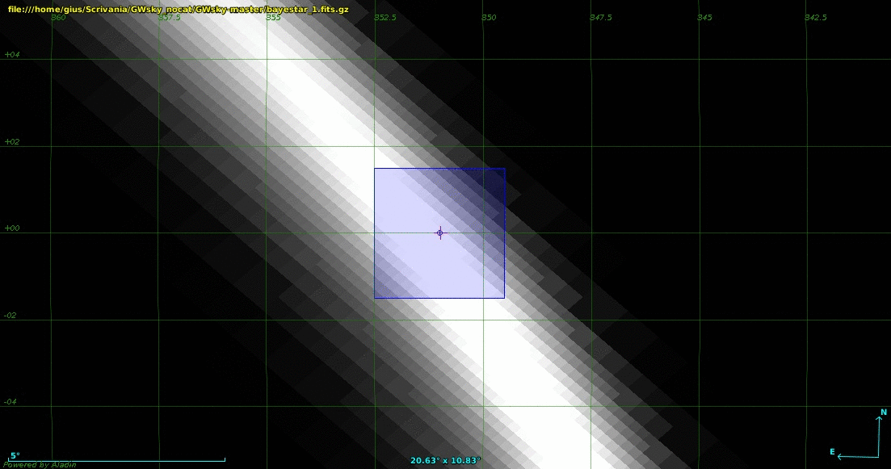

# GWsky: tiling the skymap in Fields of View
                             
GWsky is an interactive Python script to generate a sequence of pointings given a specific Field of View (FoV).
The script aims to split the large GW sky localization into several independent areas.

It defines a sequence of FoVs from a fixed position over the sky, *e.g*., starting from the highest probability pixel. 
The results are displayed in Aladin Sky Atlas (http://aladin.u-strasbg.fr/) using the SAMPIntegratedClient class.
The airmass and the integrated probability are provided in real time. Moreover, specifying the ID of a catalog, a query to the Vizier database is sent and the relative items are listed in each FoV. 
    
The FoVs are evenly spaced assuming that the shortest angular distance between two points on the celestial sphere is measured along a great circle that passes through both of them:

                            cosθ=sinδ1sinδ2+cosδ1cosδ2cos(α1−α2), 
where (α1,δ1) and (α2,δ2) are the right ascensions and declinations of the two points on the sky.

Cardinal directions are allowed and the FoVs can be overlaid or separated from the default position following the user's selection. 
A **GUI** guides the user through the sequential steps
                            https://vimeo.com/182427599

**Running it**

    >>> from GWsky import UserValues
    
    
**Building from source**

The development version can be obtained and installed from github:

    $ git clone https://github.com/ggreco77/GWsky
    $ cd GWsky
    $ (sudo) python setup.py install
    

*M. Branchesi, G. Greco and G. Stratta are supported by the Italian Ministry of Education, University 
and Research via grant FIRB 2012- RBFR12PM1F.*

